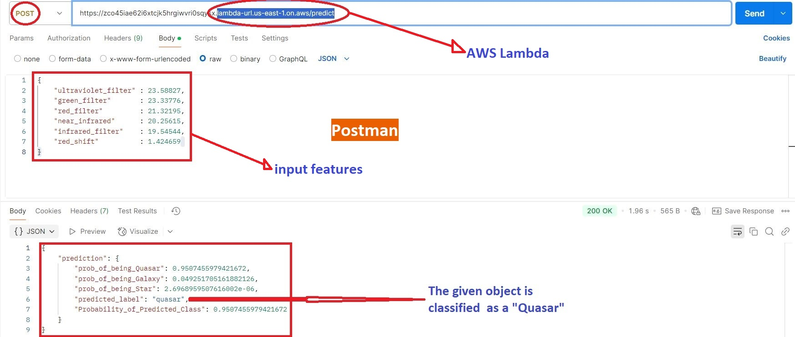
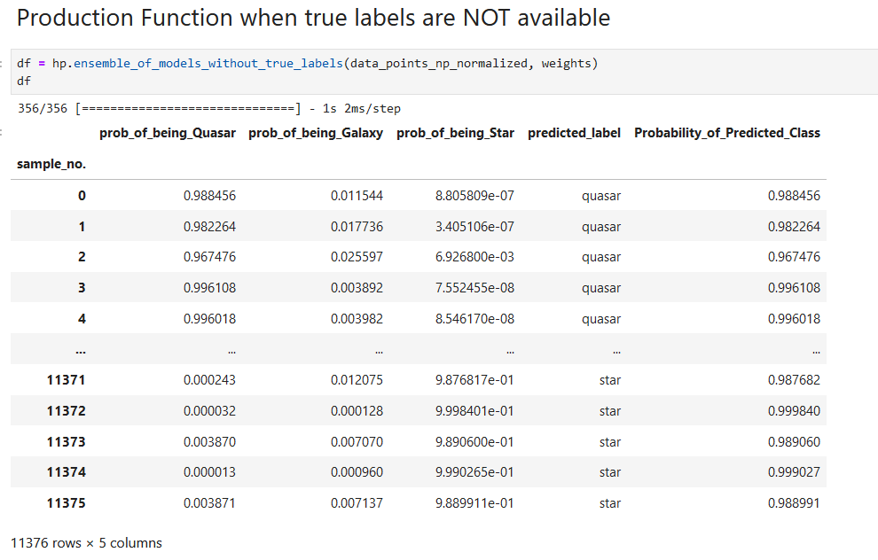

Note:

This version of the project works well if you expect around a thousand viewers per week.
But it is **not designed to scale** beyond that.

If you want a highly scalable version, contact me at **[ansimran@protonmail.com](mailto:ansimran@protonmail.com)**.

The main goal here is to **showcase Machine Learning skills**, not full-stack AI development skills.

For an example of my work in full-stack AI development with scalability in mind, you can check this project:
👉 [Production-ready self-corrective RAG](https://github.com/AnsImran/production-ready-self-corrective-RAG).

---
## End-to-End Machine Learning Project

#### Skills demonstarted:
(pandas, numpy, tensorflow, scikit-learn, matplotlib, fastapi, docker, amazon_aws_lambda, postman)

### [Data Cleaning and Data Processing](02__Data_Analysis__Training__Saving_Models/photometry.ipynb)

### [Data Visualization](02__Data_Analysis__Training__Saving_Models/photometry.ipynb)

### [Training Machine Learning Models](02__Data_Analysis__Training__Saving_Models/photometry.ipynb)

### Pre-Deployment Testing: [comparing_models](03__Pre_Deployment/03__pre_production_notebooks/01__comparing_models.ipynb) AND [pre_production_testing](03__Pre_Deployment/03__pre_production_notebooks/02__pre_production_testing.ipynb)

### [Deploying on Amazon AWS Lambda Using a Docker Container](https://github.com/AnsImran/Classifying-Quasars-Galaxies-Stars-using-Photometry/tree/master/04__Deploying_on_Amazon_Aws_Lambda)

### [Project Report](https://drive.google.com/file/d/1YuQdWmnDv7n2f3TlJHRXMCNYYN-OnXaD/view?usp=sharing) (Detailed)

---
## Deployment Snapshot on Amazon AWS Lambda

---

## Further details about this Project
### Classifying Stars, Galaxies and Quasars using Photometric Data
#### The project tries to classify Quasars, Galaxies and Stars using photometric data.
#### Motivations:
Large catalogs of unlabelled stellar objects are available. Labelling these stellar objects is important for a number of reasons. E.g: for statistical poulation analyses and for [testing cosmological models](https://academic.oup.com/mnras/article/444/1/2/1016765) to name a few. Although these stellar objects can be classified by analyzing their optical spectrums but that process is time consuming. [Next generation of telescopes](https://ui.adsabs.harvard.edu/abs/2019ApJ...873..111I/abstract) will increase the quantity of available unlabelled data even more! That's why I have tried to use the photometric data and a combination of machine learning approaches to label the stellar objects.

### [Based on Kaggle Dataset](https://www.kaggle.com/datasets/fedesoriano/stellar-classification-dataset-sdss17)

## Table of Contents [photometry.ipynb](02__Data_Analysis__Training__Saving_Models/photometry.ipynb)

### 1. Data Cleaning & Data Preparation
   - ##### Loading data as a Pandas Data Frame
   - ##### Selecting relevant columns/features
   - ##### Removing unphysical records/rows
   - ##### Undersampling
   - ##### Creating training, validation and test splits
   - ##### Converting data into numpy arrays
   - ##### Normalizing The Data

### 2. Data Visualisation
 - #### Principal Component Analysis
   - ##### Intercative 3d scatter plot

### 3. Data Classification
 - ### Unsupervised Learning
   - ##### Gaussian Mixture Model - Clustering
      - ##### Choosing the best Permutation

 - ### Supervised Learning
   - ##### Neural Network
   - ##### XGBoost
   - ##### Random Forest 

### 4. Model Ensembling
   - ##### Simple-Random-Search for weight optimization

### 5. Conclusions

### 6. What's Next?
   - ##### How can we achieve this?
   - ##### Possible Limitations

---

## Pre-Deployment Results
The results were:
- For objects correctly_classified as Quasars, 90.3% of them had a probability greater than 0.9 of being a Quasar.
- For objects correctly_classified as Galaxies, 86.7% of them had a probability greater than 0.9 of being a Galaxy.
- For objects correctly_classified as Stars, 99.6% of them had a probability greater than 0.9 of being a Star.
### Screenshots from the notebook [pre_production_testing.ipynb](03__Pre_Deployment/03__pre_production_notebooks/02__pre_production_testing.ipynb):

